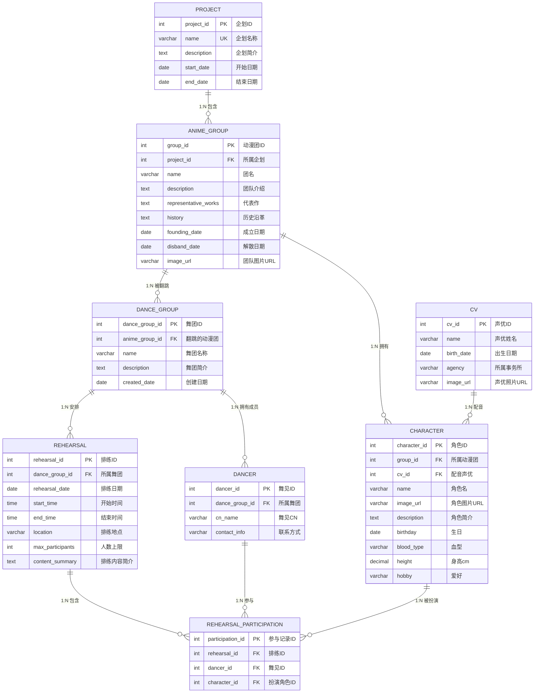
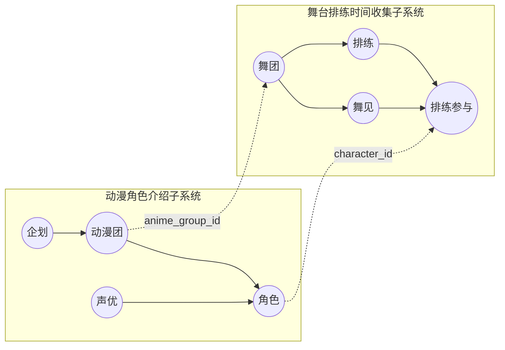

# LoveLive! 综合管理系统 — 概要设计 ER 图

> [姓名] &emsp; [学号] &emsp; 2026-06-01

---

## 实体关系图

## 子系统划分

## 实体清单

| 实体 | 中文名 | 所属子系统 | 行数估算 |
|------|--------|-----------|----------|
| PROJECT | 企划 | 角色介绍 | ~5 |
| ANIME_GROUP | 动漫团 | 角色介绍 | ~10 |
| CV | 声优 | 角色介绍 | ~50 |
| CHARACTER | 角色 | 角色介绍 | ~100 |
| DANCE_GROUP | 舞团 | 排练收集 | 动态增长 |
| DANCER | 舞见 | 排练收集 | 动态增长 |
| REHEARSAL | 排练 | 排练收集 | 动态增长 |
| REHEARSAL_PARTICIPATION | 排练参与 | 排练收集 | 动态增长 |

## 关系与级联策略

| 父实体 | 子实体 | 基数 | 子表外键 | 级联删除 |
|--------|--------|------|----------|----------|
| PROJECT | ANIME_GROUP | 1:N | project_id | CASCADE |
| ANIME_GROUP | CHARACTER | 1:N | group_id | CASCADE |
| CV | CHARACTER | 1:N | cv_id | SET NULL |
| ANIME_GROUP | DANCE_GROUP | 1:N | anime_group_id | SET NULL |
| DANCE_GROUP | DANCER | 1:N | dance_group_id | CASCADE |
| DANCE_GROUP | REHEARSAL | 1:N | dance_group_id | CASCADE |
| REHEARSAL | REHEARSAL_PARTICIPATION | 1:N | rehearsal_id | CASCADE |
| DANCER | REHEARSAL_PARTICIPATION | 1:N | dancer_id | CASCADE |
| CHARACTER | REHEARSAL_PARTICIPATION | 1:N | character_id | CASCADE |
