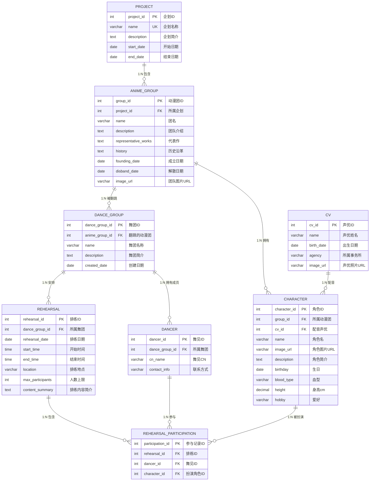
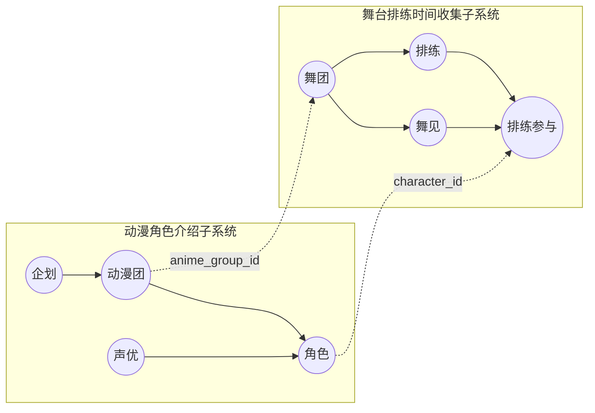

# LoveLive! 综合管理系统 — 需求分析

> 王玺玮 &emsp; PB23071333 &emsp; 2026-06-01

---

## 目录

**1. [项目概述](#1-项目概述)**
  - [1.1 背景](#11-背景)
  - [1.2 目标](#12-目标)
  - [1.3 数据规模估算](#13-数据规模估算)

**2. [数据需求分析](#2-数据需求分析)**
  - [2.1 实体](#21-实体)
  - [2.2 关系与级联策略](#22-关系与级联策略)

**3. [功能需求分析](#3-功能需求分析)**
  - [3.1 角色介绍子系统](#31-角色介绍子系统)
    - [3.1.1 数据查询](#311-数据查询)
    - [3.1.2 数据关联展示](#312-数据关联展示)
  - [3.2 排练时间收集子系统](#32-排练时间收集子系统)
    - [3.2.1 排练 CRUD](#321-排练-crud)
    - [3.2.2 时段人数统计](#322-时段人数统计)
    - [3.2.3 跨子系统联动](#323-跨子系统联动)

**4. [ER 图](#4-er-图)**
  - [4.1 子系统划分](#41-子系统划分)
  - [4.2 实体清单](#42-实体清单)
  - [4.3 关系清单](#43-关系清单)

**5. [数据库表结构设计](#5-数据库表结构设计)**
  - [5.1 project（企划表）](#51-project企划表)
  - [5.2 anime_group（动漫团表）](#52-anime_group动漫团表)
  - [5.3 cv（声优表）](#53-cv声优表)
  - [5.4 character（角色表）](#54-character角色表)
  - [5.5 dance_group（舞团表）](#55-dance_group舞团表)
  - [5.6 dancer（舞见表）](#56-dancer舞见表)
  - [5.7 rehearsal（排练表）](#57-rehearsal排练表)
  - [5.8 rehearsal_participation（排练参与表）](#58-rehearsal_participation排练参与表)

**6. [视图设计](#6-视图设计)**
  - [6.1 rehearsal_with_count（排练人数统计视图）](#61-rehearsal_with_count排练人数统计视图)
  - [6.2 character_rehearsal_summary（角色排练汇总视图）](#62-character_rehearsal_summary角色排练汇总视图)
  - [6.3 dancer_schedule_conflict_view（舞见时间冲突检测视图）](#63-dancer_schedule_conflict_view舞见时间冲突检测视图)

**7. [触发器设计](#7-触发器设计)**
  - [7.1 人数上限合法性检查](#71-人数上限合法性检查)
  - [7.2 排练满员检查](#72-排练满员检查)
  - [7.3 舞见时间冲突检查](#73-舞见时间冲突检查)

---

## 1. 项目概述

### 1.1 背景

LoveLive! 是一个跨媒体偶像企划，旗下有 μ's、Aqours、虹咲学园、Liella! 等偶像团体。粉丝中有一类叫"舞团"的组织——成员（舞见）模仿角色服装和舞蹈，进行排练和表演。平时大家用 Excel 或者群聊管理排练时间，查角色信息得去百科，两个事儿是割裂的。

### 1.2 目标

做一个 Web 系统，把两件事合在一起：

- **动漫角色介绍**：企划、动漫团、角色、声优的信息，支持按名字、团名、声优年龄等条件查。
- **舞台排练时间收集**：舞团排练的增删改查，每次排练记录谁扮演哪个角色、几点到几点、在哪儿、最多几个人。

两边通过 `anime_group ↔ dance_group` 和 `character ↔ rehearsal_participation` 两条外键打通。

### 1.3 数据规模估算

约 5 个企划、10 个动漫团、100 多个角色、50 多个声优，舞团和排练记录随使用增长。

---

## 2. 数据需求分析

### 2.1 实体

系统一共 8 个实体，分属两个子系统：

| 实体 | 中文名 | 所属子系统 | 存什么 | 约束 |
|------|--------|-----------|--------|------|
| PROJECT | 企划 | 角色介绍 | 名称、简介、起止日期 | name 唯一 |
| ANIME_GROUP | 动漫团 | 角色介绍 | 团名、介绍、代表作、历史、成立/解散日期、图片 | 外键 → project |
| CV | 声优 | 角色介绍 | 姓名、出生日期、事务所、照片 | birth_date 上建索引，用于按年龄查 |
| CHARACTER | 角色 | 角色介绍 | 角色名、图片、简介、生日、血型、身高、爱好 | 外键 → anime_group, 外键 → cv |
| DANCE_GROUP | 舞团 | 排练收集 | 舞团名、简介、创建日期 | 外键 → anime_group（可空） |
| DANCER | 舞见 | 排练收集 | CN、联系方式 | 外键 → dance_group |
| REHEARSAL | 排练 | 排练收集 | 日期、时间段、地点、人数上限、内容简介 | 外键 → dance_group, max_participants ≥ 0 |
| REHEARSAL_PARTICIPATION | 排练参与 | 排练收集 | —（三元关联表） | 外键 → rehearsal/dancer/character, (rehearsal_id, dancer_id, character_id) 唯一 |

实体之间的关系：
- PROJECT → ANIME_GROUP → CHARACTER 是企划-团体-角色三层链，CV 通过外键给角色提供声优信息。
- DANCE_GROUP → DANCER / REHEARSAL → REHEARSAL_PARTICIPATION 是舞团-排练-参与三层链。REHEARSAL_PARTICIPATION 同时连到 CHARACTER，这样就知道谁在哪次排练里扮演了哪个角色。
- DANCE_GROUP 有一个 `anime_group_id` 指到翻跳的动漫团，这是两个子系统之间最主要的连接。

### 2.2 关系与级联策略

| 父实体 | 子实体 | 基数 | 级联删除 | 级联更新 | 理由 |
|--------|--------|------|----------|----------|------|
| PROJECT | ANIME_GROUP | 1:N | CASCADE | CASCADE | 企划删了，底下的动漫团没必要留 |
| ANIME_GROUP | CHARACTER | 1:N | CASCADE | CASCADE | 动漫团删了，角色也没地方挂 |
| CV | CHARACTER | 1:N | SET NULL | CASCADE | 声优删了，角色还在，声优字段置空 |
| ANIME_GROUP | DANCE_GROUP | 1:N | SET NULL | CASCADE | 动漫团删了，舞团不一定解散 |
| DANCE_GROUP | DANCER | 1:N | CASCADE | CASCADE | 舞团解散，成员跟着删 |
| DANCE_GROUP | REHEARSAL | 1:N | CASCADE | CASCADE | 舞团解散，排练记录跟着删 |
| REHEARSAL | REHEARSAL_PARTICIPATION | 1:N | CASCADE | CASCADE | 排练取消，参与记录跟着删 |
| DANCER | REHEARSAL_PARTICIPATION | 1:N | CASCADE | CASCADE | 舞见退出，他的参与记录跟着删 |
| CHARACTER | REHEARSAL_PARTICIPATION | 1:N | CASCADE | CASCADE | 角色删了，参与记录跟着删 |

---

## 3. 功能需求分析

### 3.1 角色介绍子系统

#### 3.1.1 数据查询

| 查什么 | 怎么查 | 说明 |
|--------|--------|------|
| 企划 | 按企划名模糊搜 | LIKE |
| 动漫团 | 按团名、所属企划 | JOIN project |
| 角色 | 按角色名模糊搜、按动漫团 | JOIN anime_group |
| 声优 | 按年龄范围 | 用 birth_date 算年龄 |

#### 3.1.2 数据关联展示

- 动漫团详情：列出它下面的所有角色，以及翻跳它的舞团（通过 dance_group.anime_group_id 找）。
- 角色详情：展示属于哪个团、谁配音、被哪些舞见在哪些排练里扮演过（JOIN rehearsal_participation）。
- 声优详情：展示配过哪些角色。

### 3.2 排练时间收集子系统

#### 3.2.1 排练 CRUD

- **新增**：填舞团、日期、时间段、地点、人数上限、内容简介，选参与舞见和各自扮演的角色，写入 rehearsal 和 rehearsal_participation。
- **删除**：删排练，CASCADE 自动清理关联的参与记录。
- **修改**：可改排练基本字段和人数上限，可增减参与舞见。
- **查询**：支持按日期范围、舞团、角色、人数饱和状态筛选。

#### 3.2.2 时段人数统计

每个排练当前有多少人参与，通过 COUNT rehearsal_participation 得到。和 max_participants 对比算出饱和度。视图 rehearsal_with_count（第 6 节）直接给出分级结果：unlimited（不限人数）、available（空位多，低于一半）、half（过半）、near_full（快满了，八成以上）、full（满了）。

#### 3.2.3 跨子系统联动

- 动漫团详情 → 翻跳它的舞团 → 舞团的排练安排。
- 角色详情 → 哪些排练里被扮演 → 排练详情。
- 排练详情里点角色名 → 跳转角色详情。

---

## 4. ER 图

### 4.1 子系统划分

虚线是跨子系统的外键：

子系统 1 四个实体管作品信息。子系统 2 四个实体管排练安排。两条虚线是跨子系统的外键。

### 4.2 实体清单

| 实体 | 中文名 | 行数估算 |
|------|--------|----------|
| PROJECT | 企划 | ~5 |
| ANIME_GROUP | 动漫团 | ~10 |
| CV | 声优 | ~50 |
| CHARACTER | 角色 | ~100 |
| DANCE_GROUP | 舞团 | 动态增长 |
| DANCER | 舞见 | 动态增长 |
| REHEARSAL | 排练 | 动态增长 |
| REHEARSAL_PARTICIPATION | 排练参与 | 动态增长 |

### 4.3 关系清单

| 父实体 | 子实体 | 基数 | 子表外键 | 级联删除策略 |
|--------|--------|------|----------|-------------|
| PROJECT | ANIME_GROUP | 1:N | project_id | CASCADE |
| ANIME_GROUP | CHARACTER | 1:N | group_id | CASCADE |
| CV | CHARACTER | 1:N | cv_id | SET NULL |
| ANIME_GROUP | DANCE_GROUP | 1:N | anime_group_id | SET NULL |
| DANCE_GROUP | DANCER | 1:N | dance_group_id | CASCADE |
| DANCE_GROUP | REHEARSAL | 1:N | dance_group_id | CASCADE |
| REHEARSAL | REHEARSAL_PARTICIPATION | 1:N | rehearsal_id | CASCADE |
| DANCER | REHEARSAL_PARTICIPATION | 1:N | dancer_id | CASCADE |
| CHARACTER | REHEARSAL_PARTICIPATION | 1:N | character_id | CASCADE |

---

## 5. 数据库表结构设计

数据库用 MySQL 8.0，InnoDB 引擎，utf8mb4 字符集。

### 5.1 project（企划表）

| 字段名 | 类型 | 约束 | 说明 |
|--------|------|------|------|
| project_id | INT | PRIMARY KEY, AUTO_INCREMENT | 主键 |
| name | VARCHAR(100) | NOT NULL, UNIQUE | 企划名称 |
| description | TEXT | | 企划简介 |
| start_date | DATE | | 启动日期 |
| end_date | DATE | | 结束日期，NULL 表示仍在进行 |

### 5.2 anime_group（动漫团表）

| 字段名 | 类型 | 约束 | 说明 |
|--------|------|------|------|
| group_id | INT | PRIMARY KEY, AUTO_INCREMENT | 主键 |
| project_id | INT | NOT NULL, FOREIGN KEY → project(project_id) ON DELETE CASCADE ON UPDATE CASCADE | 所属企划 |
| name | VARCHAR(100) | NOT NULL | 团名 |
| description | TEXT | | 团队介绍 |
| representative_works | TEXT | | 代表作 |
| history | TEXT | | 历史沿革 |
| founding_date | DATE | | 成立日期 |
| disband_date | DATE | | 解散日期，NULL 表示未解散 |
| image_url | VARCHAR(500) | | 团队图片 URL |

索引：`INDEX idx_group_project (project_id)`, `INDEX idx_group_name (name)`

### 5.3 cv（声优表）

| 字段名 | 类型 | 约束 | 说明 |
|--------|------|------|------|
| cv_id | INT | PRIMARY KEY, AUTO_INCREMENT | 主键 |
| name | VARCHAR(100) | NOT NULL | 声优姓名 |
| birth_date | DATE | | 出生日期 |
| agency | VARCHAR(100) | | 所属事务所 |
| image_url | VARCHAR(500) | | 照片 URL |

索引：`INDEX idx_cv_birth (birth_date)`

### 5.4 character（角色表）

| 字段名 | 类型 | 约束 | 说明 |
|--------|------|------|------|
| character_id | INT | PRIMARY KEY, AUTO_INCREMENT | 主键 |
| group_id | INT | NOT NULL, FOREIGN KEY → anime_group(group_id) ON DELETE CASCADE ON UPDATE CASCADE | 所属动漫团 |
| cv_id | INT | FOREIGN KEY → cv(cv_id) ON DELETE SET NULL ON UPDATE CASCADE | 配音声优，声优被删除时置 NULL |
| name | VARCHAR(100) | NOT NULL | 角色名 |
| image_url | VARCHAR(500) | | 角色图片 URL |
| description | TEXT | | 角色简介 |
| birthday | DATE | | 生日 |
| blood_type | ENUM('A','B','AB','O','不明') | | 血型 |
| height | DECIMAL(5,1) | | 身高 (cm) |
| hobby | VARCHAR(500) | | 爱好 |

索引：`INDEX idx_char_group (group_id)`, `INDEX idx_char_name (name)`, `INDEX idx_char_cv (cv_id)`

### 5.5 dance_group（舞团表）

| 字段名 | 类型 | 约束 | 说明 |
|--------|------|------|------|
| dance_group_id | INT | PRIMARY KEY, AUTO_INCREMENT | 主键 |
| anime_group_id | INT | FOREIGN KEY → anime_group(group_id) ON DELETE SET NULL ON UPDATE CASCADE | 翻跳的动漫团，动漫团删除时置 NULL |
| name | VARCHAR(100) | NOT NULL | 舞团名称 |
| description | TEXT | | 舞团简介 |
| created_date | DATE | | 创建日期 |

索引：`INDEX idx_dg_anime (anime_group_id)`

### 5.6 dancer（舞见表）

| 字段名 | 类型 | 约束 | 说明 |
|--------|------|------|------|
| dancer_id | INT | PRIMARY KEY, AUTO_INCREMENT | 主键 |
| dance_group_id | INT | NOT NULL, FOREIGN KEY → dance_group(dance_group_id) ON DELETE CASCADE ON UPDATE CASCADE | 所属舞团 |
| cn_name | VARCHAR(100) | NOT NULL | 舞见 CN |
| contact_info | VARCHAR(200) | | 联系方式（选填） |

索引：`INDEX idx_dancer_group (dance_group_id)`

### 5.7 rehearsal（排练表）

| 字段名 | 类型 | 约束 | 说明 |
|--------|------|------|------|
| rehearsal_id | INT | PRIMARY KEY, AUTO_INCREMENT | 主键 |
| dance_group_id | INT | NOT NULL, FOREIGN KEY → dance_group(dance_group_id) ON DELETE CASCADE ON UPDATE CASCADE | 所属舞团 |
| rehearsal_date | DATE | NOT NULL | 排练日期 |
| start_time | TIME | NOT NULL | 开始时间 |
| end_time | TIME | NOT NULL | 结束时间 |
| location | VARCHAR(200) | NOT NULL | 排练地点 |
| max_participants | INT | DEFAULT 0 | 人数上限，0 表示不限 |
| content_summary | TEXT | | 排练内容简介 |

索引：`INDEX idx_reh_date (rehearsal_date)`, `INDEX idx_reh_group (dance_group_id)`

### 5.8 rehearsal_participation（排练参与表）

| 字段名 | 类型 | 约束 | 说明 |
|--------|------|------|------|
| participation_id | INT | PRIMARY KEY, AUTO_INCREMENT | 主键 |
| rehearsal_id | INT | NOT NULL, FOREIGN KEY → rehearsal(rehearsal_id) ON DELETE CASCADE ON UPDATE CASCADE | 排练 ID |
| dancer_id | INT | NOT NULL, FOREIGN KEY → dancer(dancer_id) ON DELETE CASCADE ON UPDATE CASCADE | 舞见 ID |
| character_id | INT | NOT NULL, FOREIGN KEY → character(character_id) ON DELETE CASCADE ON UPDATE CASCADE | 扮演角色 ID |

约束：`UNIQUE KEY uk_r_d_c (rehearsal_id, dancer_id, character_id)`。索引：`INDEX idx_rp_rehearsal (rehearsal_id)`, `INDEX idx_rp_dancer (dancer_id)`, `INDEX idx_rp_character (character_id)`

---

## 6. 视图设计

### 6.1 rehearsal_with_count

`rehearsal` LEFT JOIN `rehearsal_participation`，按排练分组聚合，算出当前参与人数和饱和度。

| 输出列 | 来源 | 说明 |
|--------|------|------|
| rehearsal_id 等基础字段 | rehearsal 表 | 排练基本信息 |
| current_participants | COUNT(rp.participation_id) | 当前参与人数 |
| occupancy_rate | current_participants / max_participants × 100 | 饱和度百分比；上限为 0 时返回 NULL |
| occupancy_status | 计算 | unlimited / available (< 50%) / half (50%~80%) / near_full (80%~100%) / full (≥ 100%) |

### 6.2 character_rehearsal_summary

`character` LEFT JOIN `rehearsal_participation` LEFT JOIN `rehearsal`，按角色分组，统计每个角色参与了多少次排练、涉及多少舞团。

输出列：character_id、character_name、rehearsal_count、dance_group_count。

### 6.3 dancer_schedule_conflict_view

`rehearsal_participation` 自连接，找出同一舞见同一天在不同排练中时间段重叠的情况。JOIN dancer 和 rehearsal 拿名字和时间。重叠判定：同日期且 `r1.start_time < r2.end_time AND r2.start_time < r1.end_time`。

输出列：dancer_id、cn_name、两个冲突的 rehearsal_id、日期、各自的起止时间。

---

## 7. 触发器设计

### 7.1 人数上限合法性检查

在 `rehearsal` 表上，BEFORE INSERT 和 BEFORE UPDATE 时检查：

- max_participants 不能是负数。
- 修改上限时如果新上限大于 0，查一下当前已有多少参与人数，新上限不能比它小。

不符合条件就报错拒绝。

### 7.2 排练满员检查

在 `rehearsal_participation` 表上，BEFORE INSERT 时检查：

- 查出对应排练的 max_participants 和当前参与人数。
- 如果 max_participants > 0 且当前人数已到上限，拒绝插入。

### 7.3 舞见时间冲突检查

在 `rehearsal_participation` 表上，BEFORE INSERT 时检查：

- 查出该舞见在同一天是否已有时间段重叠的其他排练参与。
- 有重叠就拒绝插入。

两份触发器的失败处理都通过 SIGNAL SQLSTATE '45000' 返回错误信息。
