# 数据库系统及应用 · 实验二实验报告

> **姓名**：王玺玮 &emsp; **学号**：PB23071333 &emsp; **日期**：2026-06-17


仓库地址：https://github.com/KuuKangBest/Database_lovelive.git

---
## 目录

1. [项目概述](#1-项目概述)
2. [运行与测试](#2-运行与测试)
   - 2.1 启动方式
   - 2.2 数据规模
3. [需求分析](#3-需求分析)
   - 3.1 实体与属性
   - 3.2 关系与基数
   - 3.3 级联策略
4. [概念设计：ER 图](#4-概念设计er-图)
   - 4.1 整体 ER 图
   - 4.2 子系统划分
5. [逻辑设计：关系模式](#5-逻辑设计关系模式)
   - 5.1 基本表（12 张）
   - 5.2 范式分析
6. [物理设计：DDL 实现](#6-物理设计ddl-实现)
   - 6.1 索引设计
   - 6.2 约束与默认值
   - 6.3 字符集与引擎
7. [视图与触发器](#7-视图与触发器)
   - 7.1 rehearsal_with_count 视图
   - 7.2 四个触发器
8. [后端实现](#8-后端实现)
   - 8.1 技术栈
   - 8.2 API 接口一览
   - 8.3 语义搜索模块
9. [前端实现](#9-前端实现)
   - 9.1 首页
   - 9.2 企划页
   - 9.3 团体页
   - 9.4 角色页
   - 9.5 排练页
   - 9.6 舞团页
   - 9.7 舞见页
   - 9.8 关系图谱
   - 9.9 演唱会时间轴
---

## 1. 项目概述

本实验的主题是 **LoveLive! 综合管理系统**。系统采用 **B/S 架构**（Browser/Server，浏览器/服务器模式），前端为纯 HTML/CSS/JS 单页应用，后端基于 Node.js + Express，数据库使用 MySQL 8.0。系统将粉丝社区中两个原本割裂的需求——**动漫角色信息查询**与**舞团排练管理**——整合到一个 Web 应用中，用户通过浏览器访问即可使用全部功能。

选这个主题的有如下的需求的考量：LoveLive! 系列下有 7 个企划、9 个动漫团、67 个配音角色和 60 位声优，角色信息每次都要去专门的百科上去查，其实非常不方便；大多数粉丝表达自己对企划的喜爱也就是通过组成一些舞团，翻跳企划对应的舞蹈，有翻跳那必然就会有排练管理的需求。用 Excel 或群聊管理排练效率很低，角色信息还得去百科查。一个数据库驱动的 Web 系统正好解决这两个痛点。

系统拆成两个子模块，通过 `anime_group_id` 和 `character_id` 两条外键打通：

- **动漫角色介绍子系统**：企划 → 动漫团 → 角色 ← 声优（四张表，作品信息链）
- **舞台排练时间收集子系统**：舞团 → 舞见 / 排练 → 排练参与 ← 角色（四张表，排练管理链）

---

## 2. 运行与测试

### 2.1 启动方式

**前置条件**：Node.js 18+、MySQL 8.0+（需提前启动 MySQL 服务）。

**Step 1 — 克隆仓库**：

```bash
git clone https://github.com/KuuKangBest/Database_lovelive.git
cd Database_lovelive
```

**Step 2 — 配置数据库连接**：编辑项目根目录下的 `config.js`，修改为你的 MySQL 连接信息：

```js
module.exports = {
  db: {
    host: 'localhost',
    user: 'root',
    password: '你的密码',
    database: 'lovelive_db',
  },
  server: {
    port: 3000,
  },
};
```

**Step 3 — 安装依赖并启动**：

```bash
npm install          # 安装依赖（express、mysql2、cors）
npm start            # 一键启动（检查 MySQL → 初始化数据库 → 释放端口 → 启动服务）
```

`npm start` 会自动完成四步：连通 MySQL → 检查/初始化数据库 → 释放端口 3000 → 启动 Express 服务并打开浏览器访问 `http://localhost:3000`。

如需单独操作数据库：

```bash
npm run init-db      # 删库重建 + 分层导入全部数据
npm run seed         # 仅导入种子数据（不删表）
```

### 2.2 数据规模

初始化后数据库加载了以下数据：

| 类型 | 数量 |
|------|------|
| 企划 | 6（LoveLive! / Sunshine!! / 虹咲学园 / Superstar!! / 莲之空 / 青鸟） |
| 动漫团 | 9（μ's / Aqours / 虹咲 / Liella! / 莲之空 / A-RISE / Saint Snow / Sunny Passion / 人生不易部） |
| 角色 | 67（含描述、应援色、瞳色、互动词、角色关系） |
| 声优 | 60（含出生日期，用于按年龄范围筛选） |
| 演唱会 | 每个企划的各轮巡回、Final、拼盘演出 |
| 角色关系 | 团内角色间的关系数据，支持关系图谱 |
| 排练 | 36 条测试数据（舞团、舞见、排练参与记录） |
| 语义索引 | 67 文档 · 7462 词项（TF-IDF 向量） |

---

## 3. 需求分析

### 3.1 实体与属性

系统包含 8 个核心实体，分属两个子系统：

| 实体 | 中文名 | 所属子系统 | 核心属性 | 备注 |
|------|--------|-----------|----------|------|
| project | 企划 | 角色介绍 | project_id, name, description, start_date, end_date | name 唯一 |
| anime_group | 动漫团 | 角色介绍 | group_id, project_id, name, description, founding_date, disband_date | 外键 → project |
| cv | 声优 | 角色介绍 | cv_id, name, birth_date, agency | birth_date 用于按年龄筛选 |
| character | 角色 | 角色介绍 | character_id, group_id, cv_id, name, birthday, blood_type, height, hobby, cheering_color, eye_color, call_response | 外键 → anime_group, cv |
| dance_group | 舞团 | 排练收集 | dance_group_id, anime_group_id, name, description, created_date | 外键 → anime_group，**必选** |
| dancer | 舞见 | 排练收集 | dancer_id, dance_group_id, cn_name, qq, contact_info | 支持多团（通过 dancer_group_membership 关联表） |
| rehearsal | 排练 | 排练收集 | rehearsal_id, dance_group_id, rehearsal_date, start_time, end_time, location, max_participants, content_summary, status | status 支持 active/cancelled |
| rehearsal_participation | 排练参与 | 排练收集 | participation_id, rehearsal_id, dancer_id, character_id | 三元关联，(rehearsal_id, dancer_id) 唯一 |

实际实现中扩展了 3 张辅助表和 1 张关联表：

| 附加表 | 说明 |
|--------|------|
| dancer_group_membership | 舞见-舞团多对多关联，一人可隶属多个舞团 |
| character_relationship | 角色关系（姐妹、幼驯染、搭档等），支持关系图谱 |
| concert | 演唱会信息，支持时间轴展示 |
| song / performance | 曲目与演出（表已建，数据按需加载） |

值得注意的是，这三张辅助表其实就承担了该项目中对该企划的信息进行“百科”的功能，这一部分内容变动一般非常小，在实际项目中也就起到一个搜索的功能

### 3.2 关系与基数

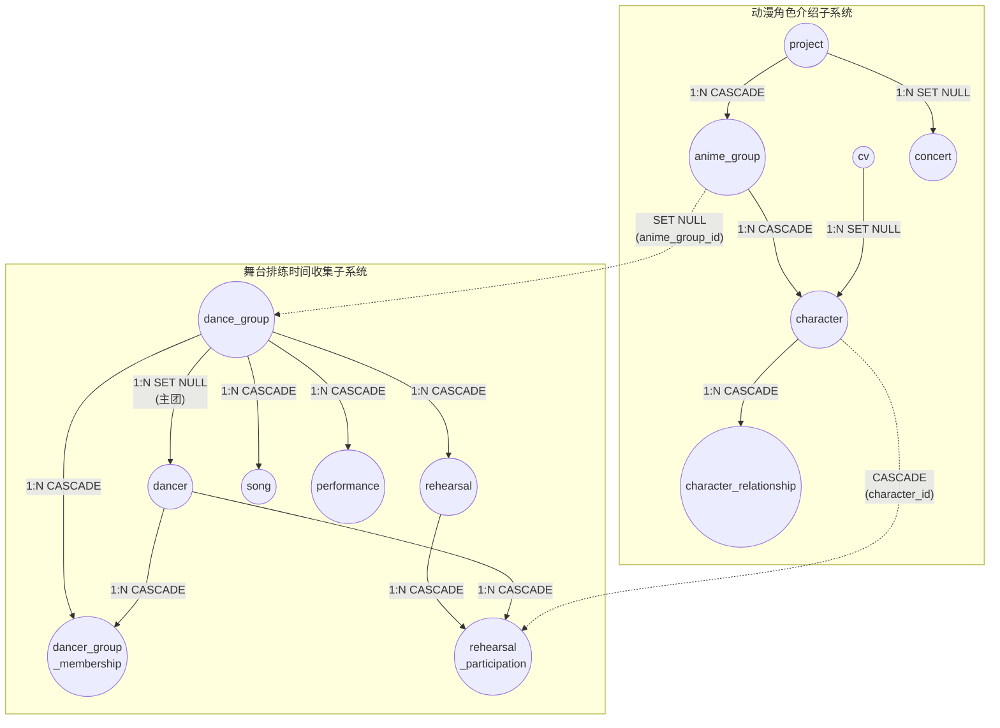
```mermaid
flowchart TB
    subgraph S1["动漫角色介绍子系统"]
        project((project))
        anime_group((anime_group))
        character((character))
        cv((cv))
        concert((concert))
        char_rel((character_relationship))

        project -->|"1:N CASCADE"| anime_group
        anime_group -->|"1:N CASCADE"| character
        cv -->|"1:N SET NULL"| character
        project -->|"1:N SET NULL"| concert
        character -->|"1:N CASCADE"| char_rel
    end

    subgraph S2["舞台排练时间收集子系统"]
        dance_group((dance_group))
        dancer((dancer))
        dg_member((dancer_group<br/>_membership))
        rehearsal((rehearsal))
        rp((rehearsal<br/>_participation))
        song((song))
        performance((performance))

        dance_group -->|"1:N SET NULL<br/>(主团)"| dancer
        dance_group -->|"1:N CASCADE"| dg_member
        dancer -->|"1:N CASCADE"| dg_member
        dance_group -->|"1:N CASCADE"| rehearsal
        dance_group -->|"1:N CASCADE"| song
        dance_group -->|"1:N CASCADE"| performance
        rehearsal -->|"1:N CASCADE"| rp
        dancer -->|"1:N CASCADE"| rp
    end

    anime_group -.->|"SET NULL<br/>(anime_group_id)"| dance_group
    character -.->|"CASCADE<br/>(character_id)"| rp
```

系统共 12 张表（8 核心 + 4 辅助），16 条外键。实线为子系统内关系，虚线为跨子系统外键。每条边上标注了基数和级联删除策略。

### 3.3 级联策略

针对每个外键制定了不同的级联策略：

| 父实体 | 子实体 | 删除策略 | 理由 |
|--------|--------|----------|------|
| project | anime_group | CASCADE | 企划删了，下面团体没地方挂 |
| anime_group | character | CASCADE | 动漫团删了，角色也没归属 |
| cv | character | **SET NULL** | 声优删了，角色还在（换人配） |
| anime_group | dance_group | **SET NULL** | 动漫团删了，舞团不一定解散 |
| dance_group | dancer | **SET NULL** | 舞团解散，舞见可转到别的团 |
| dance_group | dancer_group_membership | CASCADE | 舞团删了，成员关联跟着删 |
| dancer | dancer_group_membership | CASCADE | 舞见删了，关联记录跟着删 |
| dance_group | rehearsal | CASCADE | 舞团解散，排练跟着删 |
| rehearsal | rehearsal_participation | CASCADE | 排练取消，参与记录跟着删 |
| dancer | rehearsal_participation | CASCADE | 舞见退出，参与记录清除 |
| character | rehearsal_participation | CASCADE | 角色删了，相关参与记录清除 |

与最初需求设计相比，最终 schema 中 `dancer.dance_group_id` 的删除策略从 CASCADE 改为了 **SET NULL**，这是因为在开发过程中引入了 `dancer_group_membership` 多对多关联表来支持舞见多团归属。舞团解散后舞见的主团字段置空，但舞见本身和她在其他团的关联记录都保留。业务层在删除舞见时会判断：如果只在一个团则彻底删除，如果在多个团则只从当前团移除（通过 `DELETE /api/dancers/:id/groups/:gid` 端点）。

---

## 4. 概念设计：ER 图

### 4.1 整体 ER 图

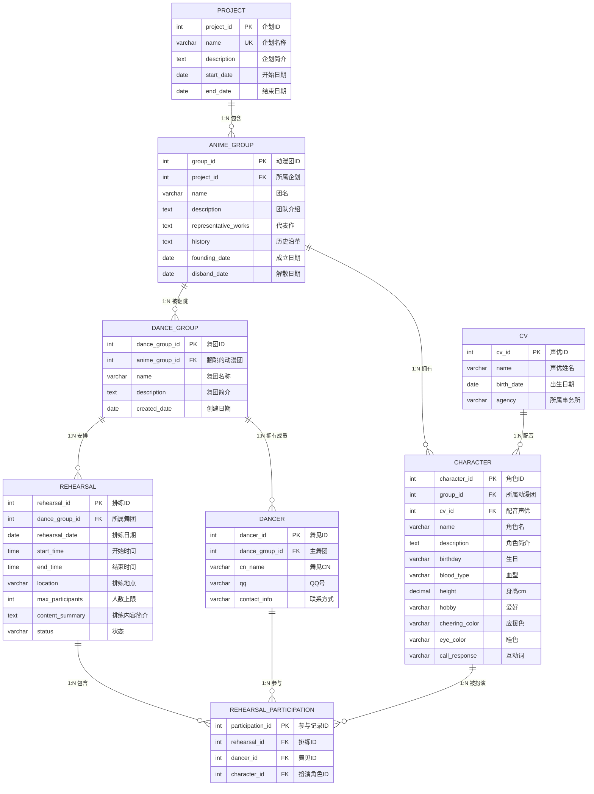
```mermaid
erDiagram
    PROJECT {
        int project_id PK "企划ID"
        varchar name UK "企划名称"
        text description "企划简介"
        date start_date "开始日期"
        date end_date "结束日期"
    }

    ANIME_GROUP {
        int group_id PK "动漫团ID"
        int project_id FK "所属企划"
        varchar name "团名"
        text description "团队介绍"
        text representative_works "代表作"
        text history "历史沿革"
        date founding_date "成立日期"
        date disband_date "解散日期"
    }

    CV {
        int cv_id PK "声优ID"
        varchar name "声优姓名"
        date birth_date "出生日期"
        varchar agency "所属事务所"
    }

    CHARACTER {
        int character_id PK "角色ID"
        int group_id FK "所属动漫团"
        int cv_id FK "配音声优"
        varchar name "角色名"
        text description "角色简介"
        varchar birthday "生日"
        varchar blood_type "血型"
        decimal height "身高cm"
        varchar hobby "爱好"
        varchar cheering_color "应援色"
        varchar eye_color "瞳色"
        varchar call_response "互动词"
    }

    DANCE_GROUP {
        int dance_group_id PK "舞团ID"
        int anime_group_id FK "翻跳的动漫团"
        varchar name "舞团名称"
        text description "舞团简介"
        date created_date "创建日期"
    }

    DANCER {
        int dancer_id PK "舞见ID"
        int dance_group_id FK "主舞团"
        varchar cn_name "舞见CN"
        varchar qq "QQ号"
        varchar contact_info "联系方式"
    }

    REHEARSAL {
        int rehearsal_id PK "排练ID"
        int dance_group_id FK "所属舞团"
        date rehearsal_date "排练日期"
        time start_time "开始时间"
        time end_time "结束时间"
        varchar location "排练地点"
        int max_participants "人数上限"
        text content_summary "排练内容简介"
        varchar status "状态"
    }

    REHEARSAL_PARTICIPATION {
        int participation_id PK "参与记录ID"
        int rehearsal_id FK "排练ID"
        int dancer_id FK "舞见ID"
        int character_id FK "扮演角色ID"
    }

    PROJECT ||--o{ ANIME_GROUP : "1:N 包含"
    ANIME_GROUP ||--o{ CHARACTER : "1:N 拥有"
    CV ||--o{ CHARACTER : "1:N 配音"
    ANIME_GROUP ||--o{ DANCE_GROUP : "1:N 被翻跳"
    DANCE_GROUP ||--o{ DANCER : "1:N 拥有成员"
    DANCE_GROUP ||--o{ REHEARSAL : "1:N 安排"
    REHEARSAL ||--o{ REHEARSAL_PARTICIPATION : "1:N 包含"
    DANCER ||--o{ REHEARSAL_PARTICIPATION : "1:N 参与"
    CHARACTER ||--o{ REHEARSAL_PARTICIPATION : "1:N 被扮演"
```

### 4.2 子系统划分

虚线是跨子系统的外键：

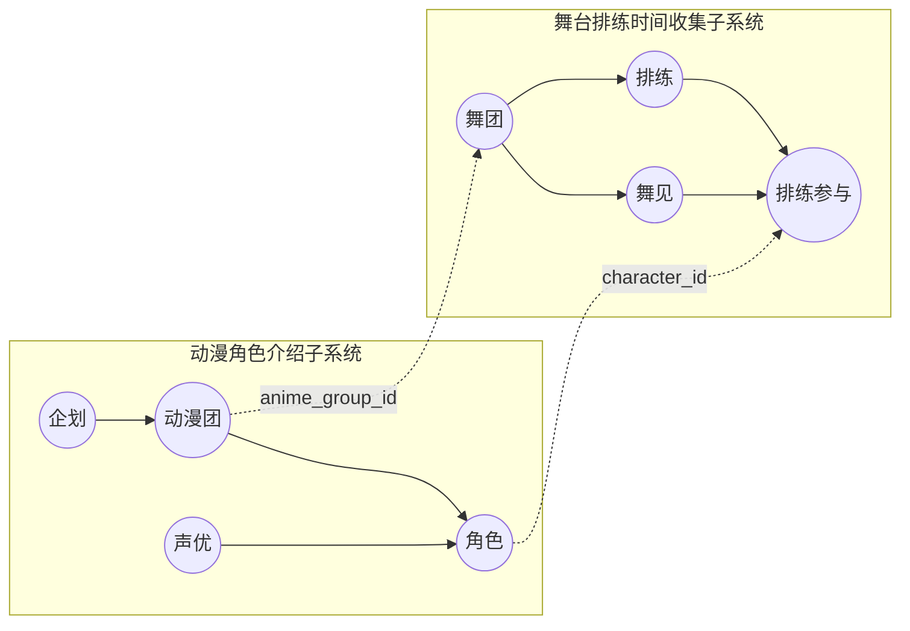
```mermaid
flowchart LR
    subgraph S1["动漫角色介绍子系统"]
        direction TB
        PROJECT((企划))
        ANIME_GROUP((动漫团))
        CHARACTER((角色))
        CV((声优))

        PROJECT --> ANIME_GROUP
        ANIME_GROUP --> CHARACTER
        CV --> CHARACTER
    end

    subgraph S2["舞台排练时间收集子系统"]
        direction TB
        DANCE_GROUP((舞团))
        DANCER((舞见))
        REHEARSAL((排练))
        PARTICIPATION((排练参与))

        DANCE_GROUP --> DANCER
        DANCE_GROUP --> REHEARSAL
        REHEARSAL --> PARTICIPATION
        DANCER --> PARTICIPATION
    end

    ANIME_GROUP -.->|anime_group_id| DANCE_GROUP
    CHARACTER -.->|character_id| PARTICIPATION
```

---

## 5. 逻辑设计：关系模式

### 5.1 基本表（12 张）

**project（企划表）**

| 字段 | 类型 | 约束 |
|------|------|------|
| project_id | INT | PK, AUTO_INCREMENT |
| name | VARCHAR(100) | NOT NULL, UNIQUE |
| description | TEXT | — |
| start_date | DATE | — |
| end_date | DATE | — |

**anime_group（动漫团表）**

| 字段 | 类型 | 约束 |
|------|------|------|
| group_id | INT | PK, AUTO_INCREMENT |
| project_id | INT | NOT NULL, FK → project ON DELETE CASCADE |
| name | VARCHAR(100) | NOT NULL |
| description | TEXT | — |
| representative_works | TEXT | — |
| history | TEXT | — |
| founding_date | DATE | — |
| disband_date | DATE | — |
| image_url | VARCHAR(500) | — |

**cv（声优表）**

| 字段 | 类型 | 约束 |
|------|------|------|
| cv_id | INT | PK, AUTO_INCREMENT |
| name | VARCHAR(100) | NOT NULL |
| birth_date | DATE | — |
| agency | VARCHAR(100) | — |
| image_url | VARCHAR(500) | — |

**character（角色表）**

| 字段 | 类型 | 约束 |
|------|------|------|
| character_id | INT | PK, AUTO_INCREMENT |
| group_id | INT | NOT NULL, FK → anime_group ON DELETE CASCADE |
| cv_id | INT | FK → cv ON DELETE SET NULL |
| name | VARCHAR(100) | NOT NULL |
| birthday | VARCHAR(5) | MM-DD 格式字符串 |
| blood_type | ENUM('A','B','AB','O','不明') | — |
| height | DECIMAL(5,1) | 单位 cm |
| hobby | VARCHAR(500) | — |
| cheering_color | VARCHAR(7) | 十六进制颜色 |
| eye_color | VARCHAR(20) | — |
| call_response | VARCHAR(200) | 互动词 |
| description | TEXT | — |

**dance_group（舞团表）**

| 字段 | 类型 | 约束 |
|------|------|------|
| dance_group_id | INT | PK, AUTO_INCREMENT |
| anime_group_id | INT | FK → anime_group ON DELETE SET NULL |
| name | VARCHAR(100) | NOT NULL |
| description | TEXT | — |
| created_date | DATE | — |

**dancer（舞见表）**

| 字段 | 类型 | 约束 |
|------|------|------|
| dancer_id | INT | PK, AUTO_INCREMENT |
| dance_group_id | INT | FK → dance_group ON DELETE SET NULL |
| cn_name | VARCHAR(100) | NOT NULL |
| qq | VARCHAR(20) | 纯数字校验 |
| contact_info | VARCHAR(200) | — |

**dancer_group_membership（舞见-舞团关联表）**

| 字段 | 类型 | 约束 |
|------|------|------|
| membership_id | INT | PK, AUTO_INCREMENT |
| dancer_id | INT | NOT NULL, FK → dancer ON DELETE CASCADE |
| dance_group_id | INT | NOT NULL, FK → dance_group ON DELETE CASCADE |
| | | UNIQUE(dancer_id, dance_group_id) |

**rehearsal（排练表）**

| 字段 | 类型 | 约束 |
|------|------|------|
| rehearsal_id | INT | PK, AUTO_INCREMENT |
| dance_group_id | INT | NOT NULL, FK → dance_group ON DELETE CASCADE |
| rehearsal_date | DATE | NOT NULL |
| start_time | TIME | NOT NULL |
| end_time | TIME | NOT NULL |
| location | VARCHAR(200) | NOT NULL |
| max_participants | INT | DEFAULT 0 |
| content_summary | TEXT | — |
| status | VARCHAR(20) | DEFAULT 'active'（active/cancelled） |
| excluded_chars | TEXT | 逗号分隔的已排除角色 ID |
| extra_chars | TEXT | 逗号分隔的跨团额外角色 ID |

**rehearsal_participation（排练参与表）**

| 字段 | 类型 | 约束 |
|------|------|------|
| participation_id | INT | PK, AUTO_INCREMENT |
| rehearsal_id | INT | NOT NULL, FK → rehearsal ON DELETE CASCADE |
| dancer_id | INT | NOT NULL, FK → dancer ON DELETE CASCADE |
| character_id | INT | NOT NULL, FK → character ON DELETE CASCADE |
| | | UNIQUE(rehearsal_id, dancer_id) |

**character_relationship（角色关系表）**

| 字段 | 类型 | 约束 |
|------|------|------|
| relationship_id | INT | PK, AUTO_INCREMENT |
| character_id_1 | INT | NOT NULL, FK → character ON DELETE CASCADE |
| character_id_2 | INT | NOT NULL, FK → character ON DELETE CASCADE |
| relation_type | ENUM('姐妹','幼驯染','搭档','憧憬','挚友','对手','同学','师徒') | NOT NULL |
| description | VARCHAR(500) | — |
| | | UNIQUE(character_id_1, character_id_2, relation_type) |

**concert（演唱会表）**

| 字段 | 类型 | 约束 |
|------|------|------|
| concert_id | INT | PK, AUTO_INCREMENT |
| project_id | INT | FK → project ON DELETE SET NULL |
| label | VARCHAR(20) | NOT NULL（如"1巡""Final""拼盘"） |
| name | VARCHAR(200) | NOT NULL |
| concert_date | DATE | — |

### 5.2 范式分析

所有表满足 3NF（第三范式）：
- **第一范式**：所有字段原子化，无重复组。角色表把 birthday 拆成 MM-DD 字符串而非日期类型，是业务选择（只比较月日而非年份），不是违反 1NF。
- **第二范式**：所有非主属性完全函数依赖于主键。例如 rehearsal_participation 的三个外键都依赖于 participation_id，不存在部分依赖。
- **第三范式**：不存在传递依赖。例如 character 表中 group_id 决定 group_name，但 group_name 不放在 character 表里（通过 JOIN anime_group 获取）。

---

## 6. 物理设计：DDL 实现

数据库选型：**MySQL 8.0**，**InnoDB** 引擎，**utf8mb4** 字符集，utf8mb4_unicode_ci 排序规则。实际建表文件：`src/server/sql/schema.sql`，共 12 张表。

### 6.1 索引设计

| 索引目标 | 索引列 | 用途 |
|----------|--------|------|
| project.name | UNIQUE(name) | 企划名唯一约束 |
| anime_group.project_id | idx_group_project | 按企划查团体 |
| anime_group.name | idx_group_name | 按团名查 |
| cv.birth_date | idx_cv_birth | WHERE TIMESTAMPDIFF 年龄过滤 |
| character.group_id | idx_char_group | 按团体查角色 |
| character.name | idx_char_name | 按角色名查 |
| character.cv_id | idx_char_cv | 按声优查角色 |
| dance_group.anime_group_id | idx_dg_anime | 按动漫团查翻跳舞团 |
| dancer.dance_group_id | idx_dancer_group | 按舞团查舞见 |
| dancer.qq | idx_dancer_qq | QQ 号搜索 |
| rehearsal.rehearsal_date | idx_reh_date | 日期范围查询 |
| rehearsal.dance_group_id | idx_reh_group | 按舞团查排练 |
| rehearsal_participation | idx_rp_rehearsal, idx_rp_dancer, idx_rp_character | JOIN 与统计常用 |
| dancer_group_membership | idx_dgm_dancer, idx_dgm_group | 多团查询 |

### 6.2 约束与默认值

- UNIQUE(rehearsal_id, dancer_id)：分身乏术：一次排练，一个舞见只能参与一次（扮演一个角色）
- UNIQUE(dancer_id, dance_group_id)：舞见不能重复加入同一舞团
- UNIQUE(character_id_1, character_id_2, relation_type)：两个角色之间同类型关系不重复
- max_participants DEFAULT 0：0 表示不限人数
- status DEFAULT 'active'：新建排练默认有效
- rehearsal 的 excluded_chars / extra_chars 字段用 TEXT 存逗号分隔的 ID 列表，支持灵活的角色槽位管理（排除不需要的角色，或添加跨团角色）

### 6.3 字符集与引擎

所有表统一使用 InnoDB 引擎。InnoDB 支持事务（排练创建使用显式事务保证一致性）、行级锁、外键约束。字符集选择 utf8mb4 是因为日语角色名和声优名可能包含 4 字节 Unicode 字符。

---

## 7. 视图与触发器

### 7.1 rehearsal_with_count 视图

这是实现中最重要的视图，聚合排练的当前参与人数和饱和度：

```sql
CREATE VIEW rehearsal_with_count AS
SELECT
    r.*,
    COUNT(rp.participation_id) AS current_participants,
    CASE
        WHEN r.max_participants = 0 THEN NULL
        ELSE ROUND(COUNT(rp.participation_id) / r.max_participants * 100, 1)
    END AS occupancy_rate,
    CASE
        WHEN r.max_participants = 0 THEN 'unlimited'
        WHEN COUNT(rp.participation_id) >= r.max_participants THEN 'full'
        WHEN COUNT(rp.participation_id) / r.max_participants >= 0.8 THEN 'near_full'
        ELSE 'available'
    END AS occupancy_status
FROM rehearsal r
LEFT JOIN rehearsal_participation rp ON r.rehearsal_id = rp.rehearsal_id
GROUP BY r.rehearsal_id;
```

四个饱和度等级在前端用不同颜色展示：unlimited（灰）、available（绿）、near_full（橙）、full（红）。

### 7.2 四个触发器

**trg_rehearsal_check_max**（BEFORE INSERT on rehearsal）：`max_participants < 0` 时 SIGNAL 拒绝。

**trg_rehearsal_update_check**（BEFORE UPDATE on rehearsal）：修改上限时检查（1）不能为负数；（2）新上限不能小于当前参与人数。

**trg_participation_check_full**（BEFORE INSERT on rehearsal_participation）：当 `max_participants > 0` 且 `current >= max_participants` 时拒绝插入。

**trg_participation_check_conflict**（BEFORE INSERT on rehearsal_participation）：检查同一舞见在同一天是否有时间段重叠的其他排练。重叠条件：

```
r1.rehearsal_date = r2.rehearsal_date
AND r1.start_time < r2.end_time
AND r2.start_time < r1.end_time
```

所有触发器使用 `SIGNAL SQLSTATE '45000'` 抛出自定义错误信息，前端可以解析并展示。

---

## 8. 后端实现

### 8.1 技术栈

- **框架**：Express.js（Node.js 18+）
- **数据库驱动**：mysql2/promise（支持 async/await 和连接池）
- **数据库**：MySQL 8.0，连接池 10 连接，dateStrings: true

入口文件 `src/server/start.js` 负责四步启动：MySQL 连通检查 → 数据库存在检查/自动初始化 → 释放端口 → 启动服务并打开浏览器。

### 8.2 API 接口一览

| 方法 | 路径 | 说明 |
|------|------|------|
| GET | /api/projects | 全部企划 |
| GET | /api/projects/:id | 单企划详情 |
| GET | /api/groups | 全部动漫团（支持 ?project_id 筛选） |
| GET | /api/groups/:id | 动漫团详情（含成员列表） |
| GET | /api/characters | 角色列表（支持 ?group_id / ?search / ?cv_age_min / ?cv_age_max） |
| GET | /api/characters/semantic | 语义搜索（?q=关键词 &top=20） |
| GET | /api/characters/:id | 角色详情（含近期排练、声优信息） |
| GET | /api/characters/:id/relationships | 角色关系列表 |
| GET | /api/seiyuu | 声优列表（支持 ?age_min / ?age_max） |
| GET | /api/seiyuu/:id | 声优详情（含配音角色） |
| GET | /api/dance-groups | 全部舞团（支持 ?anime_group_id） |
| GET | /api/dance-groups/:id | 舞团详情（含舞见、排练） |
| POST | /api/dance-groups | 新建舞团（anime_group_id 必填） |
| DELETE | /api/dance-groups/:id | 删除舞团 |
| GET | /api/dancers | 全部舞见（支持 ?dance_group_id，展示多团信息） |
| GET | /api/dancers/search | 舞见搜索（?q=cn或qq） |
| GET | /api/dancers/recommend | 舞见推荐（?dance_group_id=&character_id=） |
| GET | /api/dancers/by-character | 按角色名反查舞见 |
| GET | /api/dancers/:id/stats | 舞见扮演角色统计 |
| GET | /api/dancers/:id/rehearsals | 舞见所有排练记录 |
| GET | /api/dancers/:id/groups | 舞见所属舞团列表 |
| POST | /api/dancers | 新建舞见（QQ 数字校验） |
| PUT | /api/dancers/:id | 编辑舞见（支持跨团移动，自动保留旧团关联） |
| DELETE | /api/dancers/:id/groups/:gid | 将舞见从指定舞团移除 |
| GET | /api/rehearsals | 排练列表（支持 ?date_from / ?date_to / ?dance_group_id / ?reh_status / ?status） |
| GET | /api/rehearsals/:id | 排练详情（含参与列表、角色槽位） |
| POST | /api/rehearsals | 新建排练（事务：建排练 + 批量建参与记录 + 自动拉舞见入团） |
| PUT | /api/rehearsals/:id | 编辑排练（自动重算人数上限） |
| PUT | /api/rehearsals/:id/status | 取消/恢复排练 |
| DELETE | /api/rehearsals/:id | 删除排练 |
| POST | /api/rehearsals/:id/participants/simple | 简化指派（传 character_id + cn_name/qq，优先 QQ 搜索，自动创建舞见） |
| POST | /api/rehearsals/:id/participants | 标准指派（传 dancer_id + character_id） |
| DELETE | /api/rehearsals/:id/participants/:part_id | 删除参与记录 |
| DELETE | /api/rehearsals/:id/chars/:charId | 移除角色槽位 |
| POST | /api/rehearsals/:id/chars | 加回已排除角色 |
| POST | /api/rehearsals/:id/slots/:charId | 新增跨团角色槽位 |
| GET | /api/relationships | 全部角色关系（支持 ?group_id 按团筛选） |
| GET | /api/concerts | 演唱会列表（支持 ?project_id） |
| GET | /api/stats | 首页统计（企划数、团体数、角色数、声优数、排练数） |

所有 GET 接口返回 JSON 数组或对象，POST/PUT 接口接收 JSON body，DELETE 接口幂等。请求日志中间件记录每个请求的方法、路径、状态码和耗时。

### 8.3 语义搜索模块

这里其实做的不是很仔细，只是让ai进行了一些较为基础的实现，比如在角色搜索输入“钢琴”会显示一些喜好钢琴的动漫角色，输入“千”会显示名字跟千相关的角色（但是做的并不是很细，后续如果真的能做成比较成熟的项目在这里肯定是需要做优化的）


`src/server/semantic-search.js` 实现了一套**纯 JavaScript 的 TF-IDF + Cosine Similarity 搜索引擎**，零外部 NLP 依赖：

1. **分词**：中文 bigram（2-gram）+ 单字过滤，支持中日混合文本
2. **同义词扩展**：内置 18 组同义词映射（如"钢琴"↔"音乐""演奏"，"绘画"↔"画画""设计"）
3. **TF-IDF**：对 67 个角色的 name + hobby + description 建立倒排索引，IDF 平滑：ln((N+1)/(df+1)) + 1
4. **查询增强**：原始查询词的权重 ×3，扩展同义词权重 ×1
5. **向量检索**：预计算所有角色的 L2 归一化 TF-IDF 向量，查询时 cos 相似度排序
6. **结果**：返回 topK 结果（默认 20），带上 similarity 分数

搜索范围覆盖角色名、爱好、描述、声优名、团体名、瞳色、应援色、互动词和血型，多个查询词之间的关系是 AND（每个词都要命中）。

---

## 9. 前端实现

前端是一个纯手写的单页应用（SPA），由三个文件组成：`index.html`（页面结构）、`app.js`（~1100 行业务逻辑）、`style.css`（样式）。没有引入任何前端框架或构建工具，所有 DOM 操作、事件绑定、异步请求、Canvas 绘图均用原生 API。页面间切换通过 `showPage(name, filter)` 函数控制 CSS class `active` 的显隐，filter 参数支持跨页面传参（例如从企划卡片点击进入该企划下的团体列表）。

前端与后端通过 `fetch()` 调用 REST API 交互，所有接口返回 JSON。公共函数 `loadDGCache()` 维护舞团 ID→名称的内存缓存，减少重复请求。

### 9.1 首页

首页模块是打开系统后看到的主面板，从上到下分为四个区域：

- **统计卡片行**：4 个数字卡片，分别展示企划数、团体数、角色数、排练数。数据来自 `GET /api/stats`。卡片使用 CSS `IntersectionObserver` 实现滚动渐入动画。
- **当月排练日历**：小型月历组件（与排练页共用 `renderCal()` 逻辑），排练日显示彩色圆点（不同舞团不同颜色）。点击日期展开该日的排练列表。
- **未来两周排练**：查询 `date_from=today & date_to=today+14d` 的排练，按日期排列。已取消的排练灰色显示并标注"[已取消]"。每项可点击进入排练详情弹窗。
- **日期排练列表**：点击日历上的日期后，在该区域列出当天所有排练，含舞团名、时间段、地点、内容摘要和人数饱和度标签。

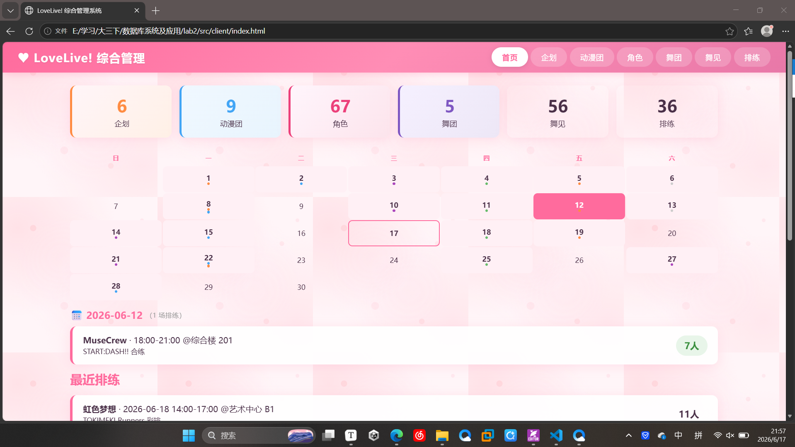

### 9.2 企划页

以卡片网格展示 6 个企划，每张卡片含企划名称、简介摘要、起止日期、下属团体数和一个"→"引导提示。卡片点击后跳转到团体页并自动按该企划筛选。

底部有一张虚线边框的特殊卡片「系列联合 & 拼盘演出」，点击展示跨团演出时间轴（数据来自 `GET /api/concerts`，`project_id IS NULL` 的记录）。

每张卡片上有一个「演唱会时间轴」按钮，点击弹出时间轴弹窗：以彩色标签（1巡/2巡/.../Final/拼盘）列出该企划历次演唱会，标签颜色按巡次区分。

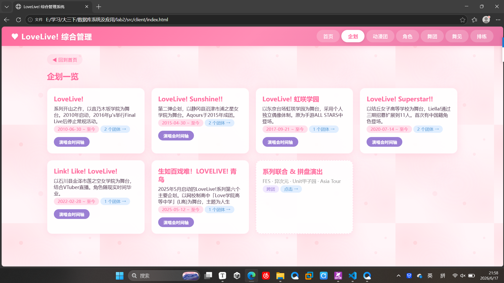

### 9.3 团体页

顶部一个下拉框按企划筛选。卡片网格展示各动漫团：卡片背景半透明显示团徽 logo，正面依次为团名、所属企划、简介、成立-解散时间、活动状态标签（"活动中"蓝色/"已结束"橙色）、角色数。点击进入该团的角色列表。

筛选联动：从企划页点击某企划卡片跳转过来时，下拉框自动选中对应企划并过滤团体。

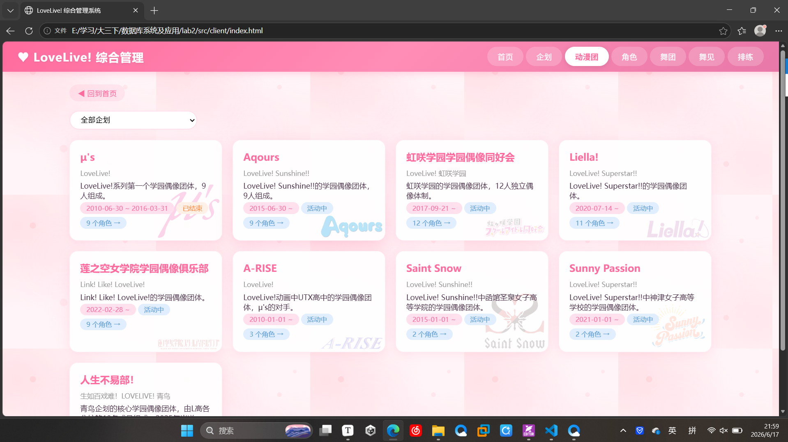

点击团体卡片后进入该团的角色列表页，展示该团下全部角色，按角色卡片网格排列：

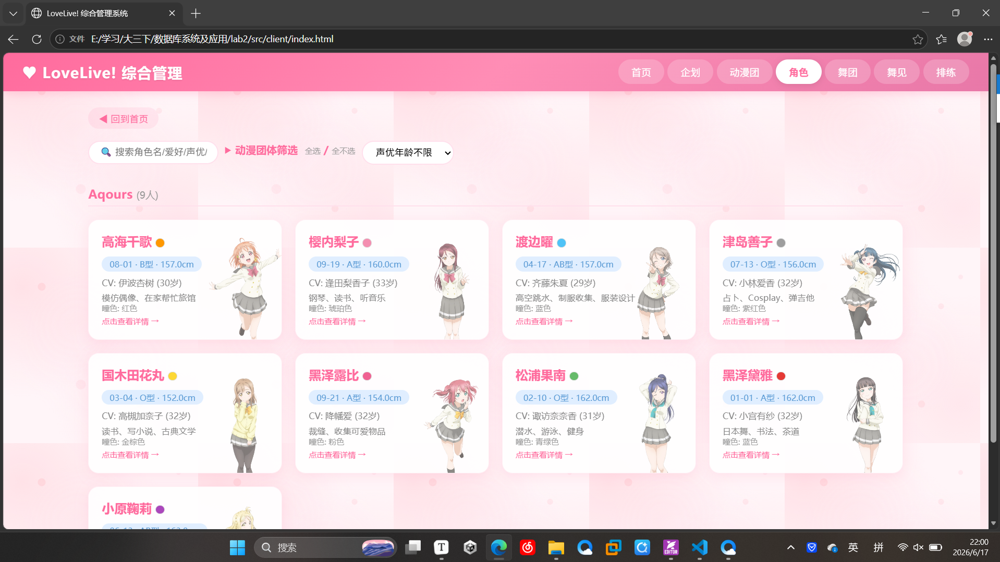

### 9.4 角色页

这是用户使用最频繁的页面，承担了"百科查询"的功能：

**顶部筛选区**：
- **团体 mini card 行**：一行可横滚的小卡片，每个团一张（含团徽和团名），点击切换选中/取消，支持"全选""全不选"按钮。选中的卡片带高亮边框。这个组件是 `buildGroupMiniCards()` 动态生成的。
- **搜索框**：支持多关键词空格分隔搜索（如 `蓝色 钢琴`），300ms 防抖。输入时实时请求 `GET /api/characters?search=...`，后端在角色名、爱好、描述、声优名、团体名、瞳色、应援色、互动词、血型 9 个字段中做 AND 匹配，按相关性评分排序。
- **声优年龄筛选**：下拉框可选择年龄段（如 30-40 岁），传入 `cv_age_min` / `cv_age_max`。

**搜索结果展示**：搜索模式下平铺展示，顶部显示搜索标签和结果数量。每张角色卡片含：角色立绘背景（`images/chars/char-{id}.png`）、角色名、应援色圆点、生日/血型/身高、CV 名及年龄、瞳色、所属团体、兴趣爱好。非搜索模式下按团体分组展示。

**语义搜索**：搜索框也支持更自然的描述（如"会弹钢琴的角色"），通过 `/api/characters/semantic?q=...` 端点触发 TF-IDF 语义匹配。


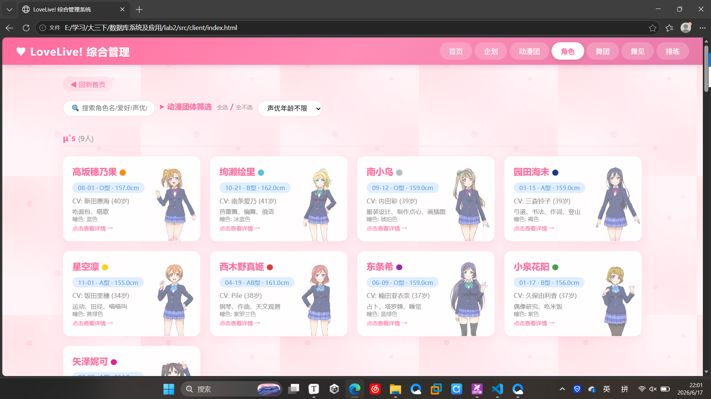

**角色详情弹窗**（`showCharDetail`）：

左侧为角色立绘或名字首字占位图，右侧展示：
- 角色名、所属团体
- CV 名（含年龄计算：`(new Date() - birth_date) / 31557600000`）
- 生日、血型、身高、瞳色、应援色（带色块）、互动词
- 角色简介（粉色背景卡片）
- **近期排练**：该角色在哪些排练中被扮演过，每条列出舞见名（可点击跳转）、排练日期、舞团名（可点击跳转），以及"查看排练"按钮。数据来自 `GET /api/characters/:id` 中 JOIN rehearsal_participation 的子查询。
- **关系图谱**按钮：点击后进入 Canvas 力导向图（见 9.8 节）

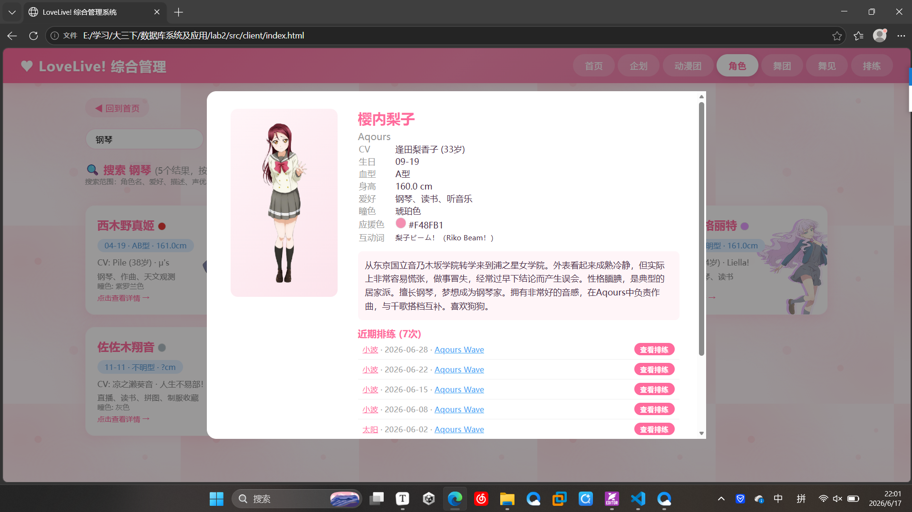

角色详情弹窗下半部分展示该角色的近期排练记录和关系图谱入口：

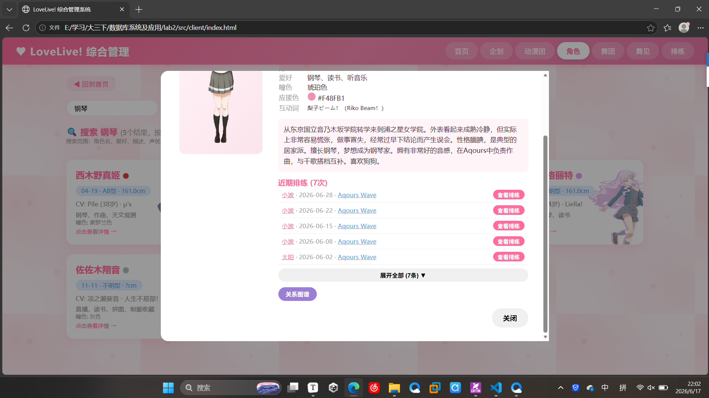

### 9.5 排练页

顶部有日期范围选择器（date-from / date-to），默认为当天。主体区域按**曲目 → 排练场次**两级分组展示：

- **曲目分组头**：渐变色卡片，显示舞团名 + 曲目名（从 `content_summary` 中提取）+ 该曲目排练次数。每个舞团有独立渐变色（`dgGradients` 映射）。
- **排练条目**：每场排练一条，含排练类型、日期、时间段、地点、人数饱和度标签（`unlimited` 灰色 / `available` 绿色 / `near_full` 橙色 / `full` 红色）、已取消标记。点击打开排练详情弹窗。
- **日历视图**：页面顶部有一个月历组件，排练日用彩色圆点标注，点击日期自动填入日期筛选器并刷新列表。

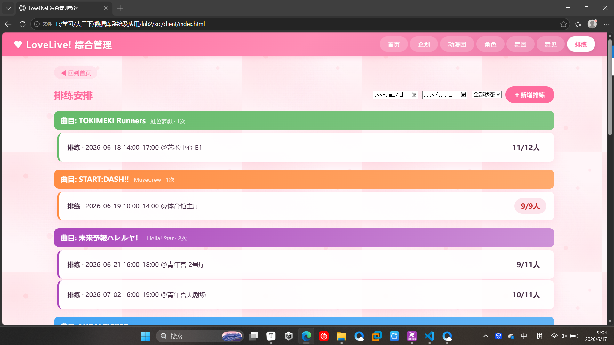

**排练详情弹窗**（`buildRehModal`）：

这是整个系统中最复杂的 UI 组件：
- **顶部信息栏**：渐变色标题条，展示舞团名、日期、内容摘要、时间段、地点。已取消排练显示灰色+特殊标记。
- **角色槽位卡片网格**（`reh-parts-grid`）：每个角色一个槽位卡片，已填的显示角色名（应援色）+ 舞见名 + 编辑/删除按钮；空缺的显示"空缺"+"+ 指派"按钮。角色槽位由该排练所属舞团的翻跳动漫团决定（`anime_group_id → group.members`），再减去 `excluded_chars`。
- **指派弹窗**（`showAssignPopup`）：搜索框 + 推荐区（本团推荐绿色、别团推荐橙色，按历史出演次数降序）+ 搜索结果区 + 新建舞见表单（CN + QQ，QQ 纯数字校验）。推荐数据来自 `GET /api/dancers/recommend?dance_group_id=&character_id=`。


搜索舞见 CN 或 QQ 后显示匹配结果，点击即可指派：

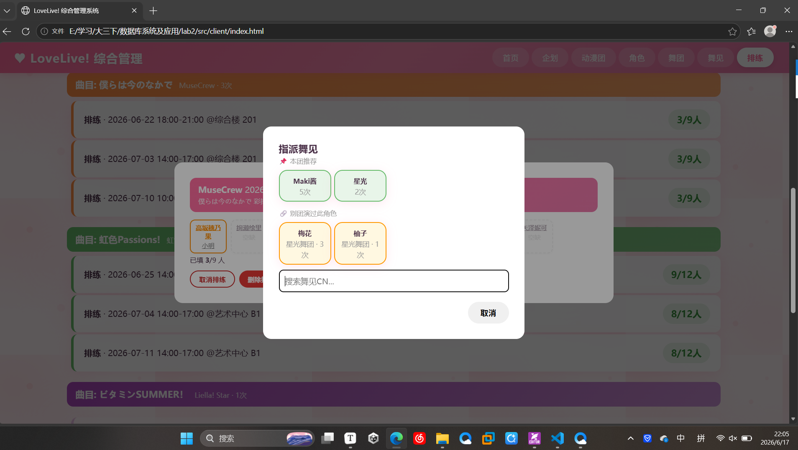
- **底部操作栏**：取消/恢复排练按钮、删除排练按钮。取消排练调用 `PUT /api/rehearsals/:id/status` 将 status 改为 cancelled，排练条目变灰但仍保留在列表中。
- **角色槽位管理**：编辑模式下可以移除角色槽位（加入 excluded_chars），或通过"添加角色卡片"弹窗从同团已排除角色或其他团角色中添加跨团槽位（`extra_chars`）。

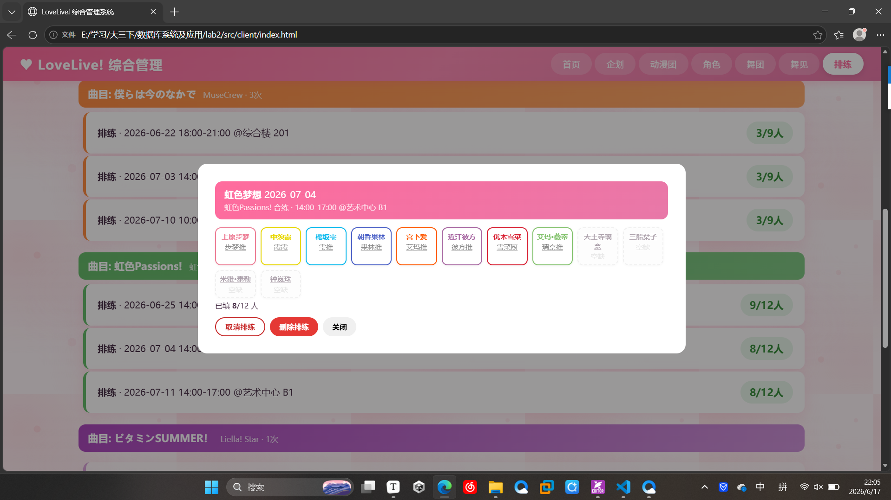

**新建排练弹窗**（`openAddRehearsal`）：

- 选择已有舞团或输入新舞团名（自动创建）
- 选择舞团后自动加载该团翻跳的动漫团全部角色，渲染为角色槽位网格
- 每个槽位可点击指派舞见：弹窗含推荐（本团/别团）+ 搜索（CN/QQ）+ 新建
- 日期、起止时间、地点、内容摘要表单
- 提交时自动处理：创建舞见（如不存在）、拉舞见入团（`ensureMembership`）、切换主团（如舞见在其他团）、建排练+参与记录（事务）

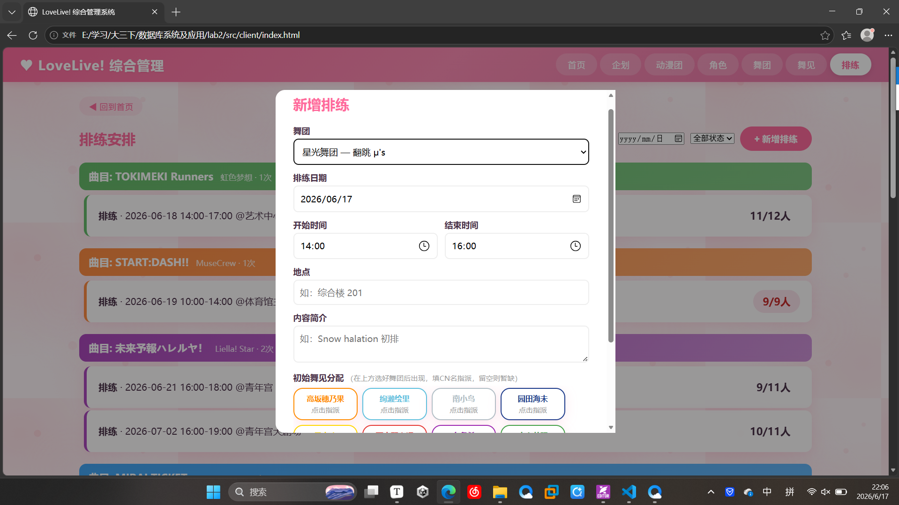

### 9.6 舞团页

- **舞团列表**：每张卡片展示舞团名、翻跳来源（`anime_group_name`）、背景半透明团徽。右上角"解散"按钮，点击后确认删除（提示将级联删除该团所有舞见和排练）。
- **新建舞团表单**：输入舞团名 + 选择翻跳团体（下拉框列出全部动漫团，**必选**）+ 确认按钮。`POST /api/dance-groups`，后端校验 `anime_group_id` 不能为空。
- **舞团详情弹窗**（`showDgDetail`）：舞团基本信息 + 舞见标签列表（点击跳转舞见详情）+ 按曲目分组的排练列表。

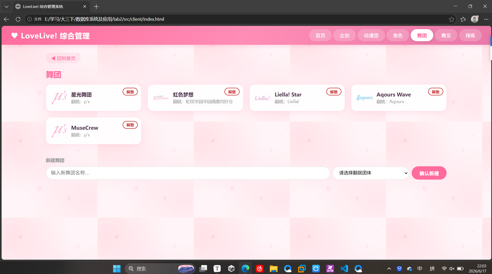

### 9.7 舞见页

这是系统中功能最复杂的列表页：

**筛选区**：
- 舞团下拉筛选：按主团或关联团过滤
- CN 名搜索：输入即过滤（客户端模糊匹配）
- QQ 搜索：按 QQ 号过滤
- **角色偏见卡片选择器**（`buildCharBiasCards`）：按动漫团分组展示所有角色的 mini 卡片（含应援色背景），可多选。选中后调用 `GET /api/dancers/by-character?q=角色名1,角色名2` 后端接口，反查历史上扮演过这些角色的舞见。选中的角色卡片高亮显示其应援色。这是"角色偏见"功能的体现——用户可以说"我想找演过高坂穗乃果的舞见"。

**列表展示**：舞见按所属舞团分组（支持多团——同一舞见出现在多个团下时在各团各显示一张卡片，带"+N团"标识）。每张卡片含：
- CN 名
- QQ 号标签
- 角色偏好（出演次数最多的角色名）
- 卡片边框色 = 偏好角色的应援色
- 编辑按钮（跳转编辑弹窗）、移除按钮（区分"从当前团移除"/"彻底删除"）

**舞见编辑弹窗**：CN 名 + QQ 号（纯数字校验）+ 所属舞团下拉框。支持修改主团：如果修改后的主团与旧主团不同，旧团自动保留在 `dancer_group_membership` 中，实现无感的多团迁移。

**舞见详情弹窗**（`showDancerDetail`）：
- 头像占位（CN 名首字）+ CN 名
- 所属舞团标签列表（主团 + 关联团），点击可跳转舞团详情
- **出演角色统计**：按扮演次数降序排列的角色卡片，卡片顶部色条为角色应援色，点击可跳转角色详情。数据来自 `GET /api/dancers/:id/stats`（GROUP BY character_id + COUNT）。
- **全部排练记录**：该舞见参与的所有排练，每条列出角色名（带应援色圆点）+ 舞团名 + 日期 + 时间段 + 地点 + 内容摘要。已取消排练灰色标注。按日期倒序排列。数据来自 `GET /api/dancers/:id/rehearsals`。

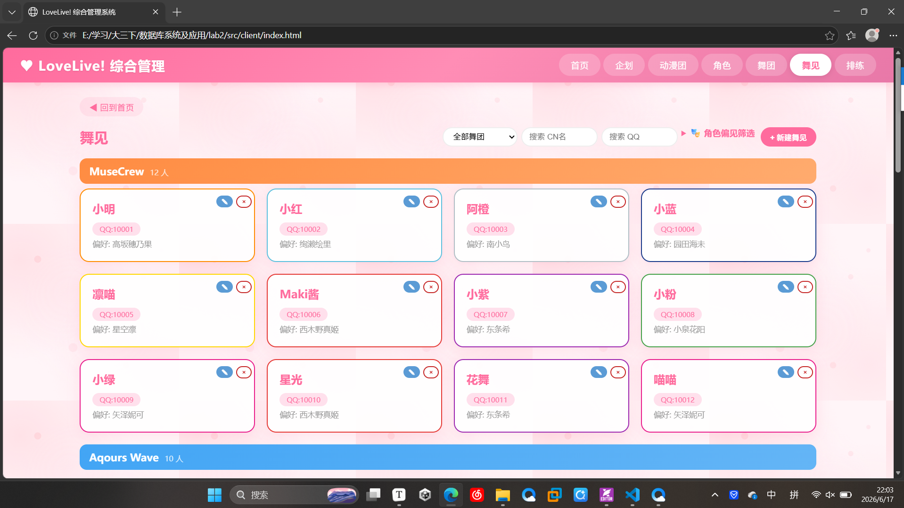

点击舞见卡片进入详情弹窗，展示所属舞团、出演角色统计和全部排练记录：

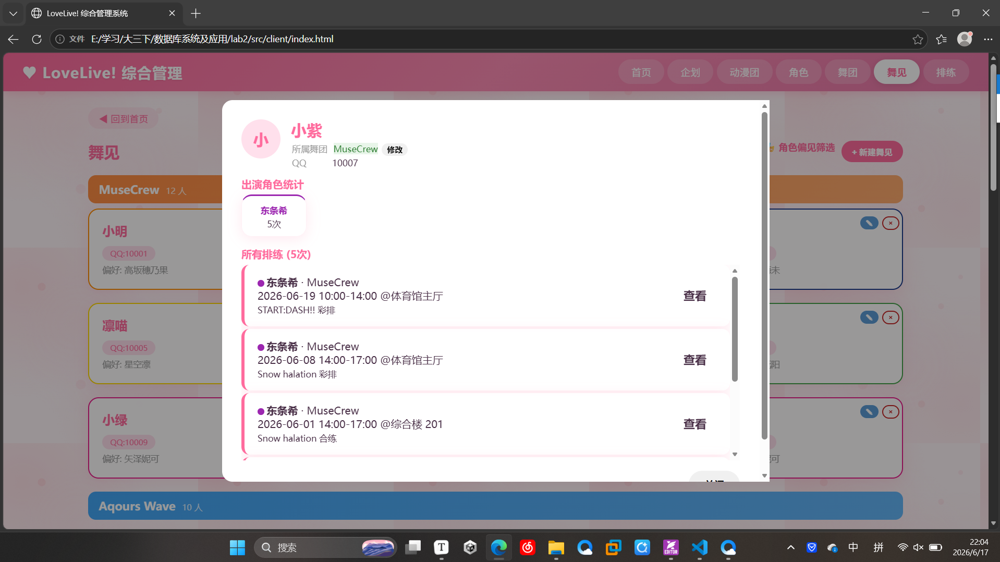

### 9.8 关系图谱

角色详情弹窗中点击"关系图谱"按钮，从 `GET /api/characters/:id/relationships` 加载该角色同团成员之间的关系数据，在 Canvas 上绘制力导向图。节点大小区分中心角色（34px，带虚线外环）和普通角色（24px），节点颜色为角色应援色。8 种关系类型用不同颜色区分：姐妹（#e91e63）、幼驯染（#ff9800）、搭档（#4caf50）、憧憬（#9c27b0）、挚友（#2196f3）、对手（#f44336）、同学（#607d8b）、师徒（#00bcd4）。关系边上的标签带白色背景，单向关系（憧憬、对手）只画单向箭头，其余双向。节点可拖拽，点击其他角色节点可跳转该角色的详情。

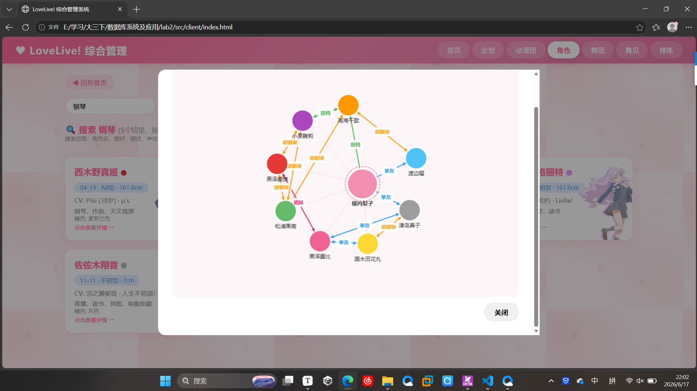

### 9.9 演唱会时间轴

在企划页或团体页中点击"演唱会时间轴"按钮，弹出表格式时间轴。每行一场演唱会，含彩色标签（按巡次/类型分色）、日期、演唱会名称。不同巡次的标签颜色各异：1巡绿、2巡蓝、3巡紫、4巡橙、5巡红、Final 深红等。数据来自 `GET /api/concerts?project_id=...`。

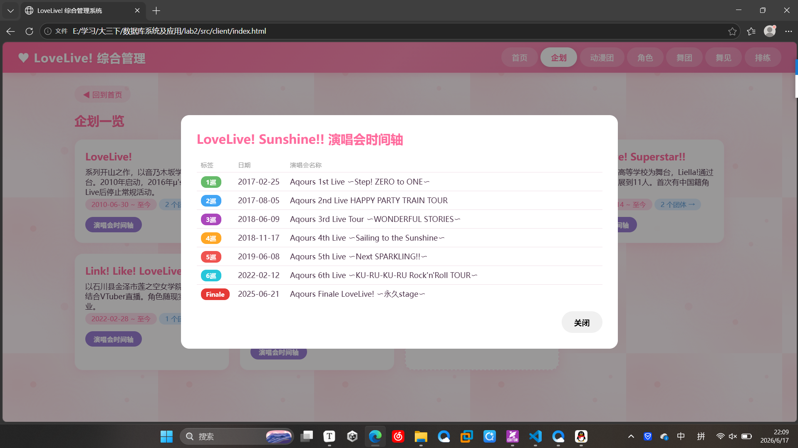
